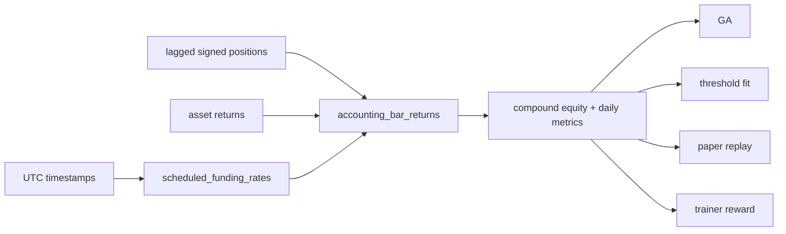

# PRP: 28c Accounting Correction

## 1. Problem Statement

The 28c search and paper paths currently use incompatible accounting models:

- `research/ga_28c_30m_3y.py` annualizes 30m returns, subtracts funding from `abs(position)` at every event, and computes additive-PnL MDD. This produced impossible MDD values such as 578,934.
- `research/threshold_fit_28c_3y.py` uses the same additive-PnL MDD and bar Sharpe, and also charges absolute-position funding.
- `research/run_paper_28c_pit_30m.py` uses additive cumulative PnL for portfolio equity, fixed per-bar funding rather than 00/08/16 UTC events, and reports legacy engine metrics that are not the authoritative portfolio metrics.
- `research/train_12f_30m.py` derives the 28c reward from `MemeBacktest.last_metrics`, which uses per-bar Sharpe and a different drawdown convention.

The result is that search, training, and paper diagnostics do not measure the same strategy. No candidate may be adopted until the accounting contract is shared and tested.

## 2. Scope and Requirements

### 2.1 Shared accounting contract

Create a small pure-NumPy module, `research/accounting_28c.py`, used by all 28c paths:

1. **Returns and costs are simple bar returns.** For a signed position `p[t]` already lagged to the executable bar:
   - `gross[t] = p[t] * asset_return[t] * leverage`
   - `turnover[t] = abs(p[t] - p[t-1])`; use `p[-1] = 0` only for a standalone window with no prior position, otherwise pass the actual prior notional/position.
   - `fee[t] = turnover[t] * fee_rate * leverage`
   - `funding_cost[t] = p[t] * funding_rate[t] * leverage`
   - `net[t] = gross[t] - fee[t] - funding_cost[t]`
2. **Funding events are scheduled, signed, and sparse.** Generate an assumed funding-rate array from UTC timestamps. The only nonzero events are timestamps at exactly 00:00, 08:00, and 16:00 UTC. A positive rate is a cost for a long and a receipt for a short. The implementation must not charge funding on ordinary bars or charge both sides unconditionally. The rate remains an explicit assumption (`0.0005` unless configured); it is not represented as exchange actuals.
3. **Equity compounds.** Starting at 1.0, `equity[t] = equity[t-1] * (1 + net[t])`. Do not use `1 + cumsum(net)` for authoritative metrics. If `1 + net[t] <= 0`, mark that account path insolvent, set subsequent equity to zero, report `solvent: false`, and report `mdd: 1.0`; never silently clip a loss into a plausible return. Solvency is a **portfolio-level gate**: isolated per-leg diagnostics may be insolvent because a single unit-notional leg can exceed -100%, but one such leg must not automatically mark the diversified portfolio insolvent.
4. **MDD is equity-relative.** Include the initial equity point, update the peak, and return a fraction in `[0, 1]`.
5. **Sharpe is daily-return Sharpe.** Group bar returns by UTC calendar day, compound each day, then calculate sample Sharpe (`ddof=1`) annualized by `sqrt(365)`. A single-day or zero-variance sample returns 0.0. The output must state the annualization convention. Daily Sharpe and the floor are in the same units; no hidden per-bar conversion is allowed.
6. **Portfolio notionals.** For a portfolio with capital weights `w[t,i]` and signed positions `p[t,i]`, use `notional[t,i] = w[t,i] * p[t,i]`, `gross[t] = leverage * sum_i(notional[t,i] * asset_return[t,i])`, `turnover[t] = sum_i(abs(notional[t,i] - notional[t-1,i]))`, and `funding_cost[t] = leverage * sum_i(notional[t,i] * funding_rate[t])`. This single formula includes both position changes and capital reallocation; do not add a second `sum(abs(delta_weight))` fee. For a single-leg diagnostic, use weight 1.0. If an impact estimate is available, fold it into the per-notional fee rate before calling the helper; do not silently discard it.
7. **Window continuity.** Compute net returns once over the full aligned series whenever a formula is evaluated on train, validation, and lockbox slices. Slice the resulting return series for metrics; do not reset the prior position or charge an artificial entry fee at every split boundary. A standalone single-window API call starts flat only when no prior position is supplied.
8. **Reward calibration.** The migrated 28c GA uses `mean_ic + 0.20 * daily_portfolio_sharpe - 0.01 * mean_turnover - 0.20 * softplus((floor - min_leg_daily_sharpe) / 0.5)`. The trainer keeps its `0.10` turnover-excess penalty and `0.5` floor-penalty coefficient because its score and floor are both daily Sharpe units. These constants are versioned with `equity-compound-v2`; old scores are not comparable.
9. **Validation and output.** Reject non-finite inputs, mismatched lengths, and invalid leverage. Return `sharpe`, `mdd`, `final_x`, `total_return`, `mean_bar_return`, `solvent`, `daily_return_count`, and the fixed string `equity-compound-v2`.

### 2.2 Consumers to migrate

- `research/ga_28c_30m_3y.py`
  - Use timestamp-derived scheduled funding rates.
  - Use the shared bar-accounting and metrics functions for every leg and the portfolio.
  - Use daily Sharpe for selection/reporting and equity-relative MDD for acceptance.
  - Include portfolio `solvent` in the acceptance record and require it to be true; do not use isolated per-leg solvency as a portfolio gate.
  - Preserve train/validation-only selection and one final lockbox report.
- `research/threshold_fit_28c_3y.py`
  - Use the same signed event funding, compounded equity, daily Sharpe, and MDD functions.
  - Preserve train/validation-only threshold selection and final lockbox reporting.
- `research/run_paper_28c_pit_30m.py`
  - Use the shared functions for leg and portfolio metrics.
  - Apply funding only at scheduled events using the lagged signed position.
  - Compute portfolio costs from weighted signed notionals (`w * p`) in the shared helper. This captures position turnover and capital reallocation exactly once; do not add a separate weight-turnover fee.
  - Keep the ledger's initial-equity-plus-one-point convention and use the same compounded curve.
  - Add explicit accounting metadata (`accounting_version`, funding schedule, daily Sharpe convention, and notional-turnover convention). Mark legacy `MemeBacktest` metrics as diagnostic only; do not use them for the acceptance gate.
  - Keep `live_adopted: false`, no broker imports, no network, and no orders.
- `research/train_12f_30m.py`
  - For `TRAIN_UNIVERSE_28C=1`, derive the lagged position from a single shared `position_from_signal` helper that matches the existing sigmoid, safe-liquidity, cooldown, stop-loss, and one-bar-lag rules, and score it with the shared accounting functions and daily Sharpe. Thread the UTC timestamps through `build_tensors` rather than reconstructing them from row indices.
  - Do not change the legacy five-coin training path in this PRP.
  - Preserve causal features, train-only trimming, grammar masking, and the floor-constrained reward structure. Recalibrate the 28c reward constants once, in the shared implementation, so daily Sharpe and the floor are measured in the same units; do not compare scores from the old accounting.

Do not change the data contract, lockbox boundaries, universe, feature formulas, or demo/broker code.

## 3. Architecture

The shared module must have no broker, network, database, or model dependency. Consumers remain responsible for their existing signal, position, and universe logic.

## 4. Acceptance Criteria

- [ ] A synthetic long position at a positive funding event has a negative funding cash flow; a short has a positive cash flow. The test also pins `FUND=0.0005` as a per-8h-event assumption.
- [ ] No funding is charged at 00:30 or other non-event bars.
- [ ] `[0.10, -0.20, 0.05]` produces equity `[1.10, 0.88, 0.924]`, not an additive-PnL curve; MDD is 0.20.
- [ ] A return at or below -1.0 is marked insolvent for that account; only the diversified portfolio solvency flag can satisfy the acceptance gate. `positive_coins` means per-leg daily Sharpe > 0 and does not require isolated-leg solvency.
- [ ] Daily Sharpe is invariant to how bars are grouped within the same UTC day and uses 365-day annualization; a pinned fixture asserts the exact value.
- [ ] GA, threshold-fit, paper, and 28c trainer all call the shared accounting API; no authoritative 28c metric uses `cumsum` equity or per-bar Sharpe.
- [ ] Paper JSON reports `accounting_version`, scheduled funding metadata, daily Sharpe convention, and notional-turnover convention; `live_adopted` remains false.
- [ ] Existing data-contract, causality, paper-broker-free, and acceptance-gate tests remain green; old artifacts without `equity-compound-v2` are rejected rather than silently compared.
- [ ] A one-generation GA smoke and a paper replay complete without NaN/Infinity or impossible MDD values; an isolated KAS-like leg may report insolvency without failing a diversified portfolio.
- [ ] Codex review returns PASS before any result is considered for adoption.

## 5. Test Plan

### Unit tests (`tests/test_accounting_28c.py`)

- Funding event detection at 00:00, 08:00, 16:00 UTC and rejection of 00:30.
- Long/short funding direction and fee/turnover arithmetic.
- Compounded equity, drawdown, final multiplier, and return validation.
- Daily aggregation and Sharpe annualization.
- Insolvency fail-closed behavior.

### Integration tests

- Run the existing paper tests and assert `stats.mdd` is finite and in `[0,1]`, `stats.solvent` is present, and funding metadata is explicit.
- Run a small GA invocation and inspect the JSON accounting fields and acceptance structure.

### Regression checks

- `tests/test_data_contract_28c.py`
- `tests/test_28c_acceptance_gate.py`
- `tests/test_paper_28c_pit_30m.py`
- `tests/test_formula_grammar.py`
- `tools/validate_data_contract_28c.py`

## 6. Risks and Mitigations

| Risk | Likelihood | Impact | Mitigation |
|---|---|---|---|
| Weight turnover double-counts leg turnover | Medium | Medium | Document that leg turnover is position change; weight turnover is capital reallocation; test each independently |
| Daily grouping changes historical comparisons | High | Medium | Add `accounting_version` and never mix old/new metrics |
| Trainer and GA reward semantics diverge | Medium | High | Route all 28c consumers through the same helper, recalibrate daily-Sharpe reward constants, and add source assertions |
| Insolvency is hidden by clipping | Low | High | Explicit `solvent` flag, MDD=1.0, and acceptance requires solvent |
| Fold/window boundary fees are ambiguous | Medium | Medium | Compute net once over the full aligned lagged series, then slice returns for train/validation/lockbox; only a standalone call with no prior position starts flat. Add a no-boundary-fee test. |
| Existing dirty work is overwritten | Medium | High | Edit only listed files; do not reset, clean, or commit unrelated changes |

## 7. Rollback Plan

Rollback is a source-only rollback of the accounting migration. Keep the prior result JSON files untouched and mark any new output `accounting_version: equity-compound-v2`. If a consumer fails closed, do not fall back to the old accounting implementation; retain the old artifact for diagnosis only.

## 8. Sign-offs

- Planner (root): approved for code phase
- Architect (Claude): PASS — implementation order confirmed feasible; shared position extraction and versioned daily accounting are required.
- Reviewer (Codex): PASS after the clarified full-series slicing rule was added.
